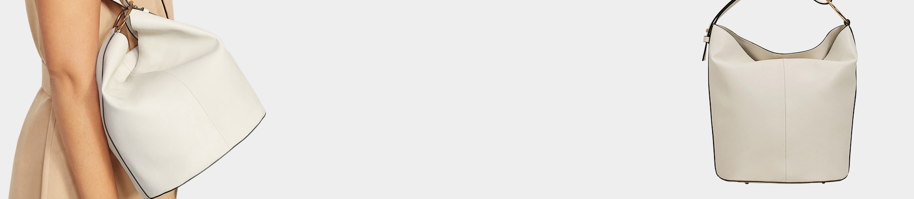

# 🛍️ BuzzBuy - Responsive Shopping Website

---

## 📦 Project Structure

```
index.html
main.js
style.css
images/
├── card-image1.jpg
├── card-image2.jpg
├── card-image3.jpg
├── card-image4.jpg
├── card-image5.jpg
├── card-image6.jpg
├── card-image7.jpg
├── card-image8.jpg
├── card-image9.jpg
├── card-image10.jpg
├── card-image11.jpg
├── card-image12.jpg
├── for accessories.jpg
├── for kids.jpg
├── for men.jpg
├── for women.jpg
├── hero-image.jpg
├── news-image1.jpg
├── news-image2.jpg
├── news-image3.jpg
└── sale-image.jpg
```

---

## 🖥️ Overview

**BuzzBuy** is a modern, responsive shopping website template built with HTML, CSS, and JavaScript. It features a clean design, interactive navigation, and multiple product sections, making it ideal for online stores.

---

## 🎨 Features

- **Responsive Design:** Adapts seamlessly to all screen sizes.
- **Sticky Navbar:** Fixed navigation bar with hamburger menu for mobile.
- **Hero Section:** Eye-catching banner with call-to-action.
- **Product Categories:** Grid layout for Men, Women, Kids, and Accessories.
- **Product Cards:** Sale and New tags, hover effects, and Add to Cart buttons.
- **Sale Banner:** Highlighted section for weekly deals.
- **Info Boxes:** Shipping, Payment, Gifts, and Opening Hours.
- **Newsletter Signup:** Integrated email subscription form.
- **Social Media Links:** Quick access to popular platforms.
- **Footer:** Organized links and contact information.

---

## 🚀 Getting Started

1. **Clone the repository:**
   ```sh
   git clone <your-repo-url>
   ```
2. **Open the project folder in VS Code or your preferred editor.**
3. **Start a local server** (optional for live reload):
   - Use [Live Server](https://marketplace.visualstudio.com/items?itemName=ritwickdey.LiveServer) extension in VS Code.
4. **View `index.html` in your browser.**

---

## 🗂️ File Details

- [`index.html`](index.html): Main HTML structure.
- [`style.css`](style.css): All styles and responsive rules.
- [`main.js`](main.js): Navbar hamburger menu toggle.
- [`images/`](images/): Product, category, and banner images.

---

## 🛠️ Customization

- **Add Products:** Place new images in `images/` and update HTML.
- **Change Colors:** Edit CSS variables in `style.css`.
- **Update Content:** Modify text in `index.html` for your brand.

---

## 📱 Responsive Preview

| Desktop 💻 | Tablet 📱 | Mobile 📲 |
|:----------:|:---------:|:---------:|
|  |  |  |

---

## 🧩 Technologies Used

- HTML5
- CSS3 ([Poppins](https://fonts.google.com/specimen/Poppins) font, Font Awesome icons)
- JavaScript (ES6)

---

## 📝 License

This project is for educational and personal use. Feel free to modify and share!

---

## ✨ Author

- **BuzzBuy** by [Your Name]

---

## 📬 Contact

- 📧 buzzbuy@gmail.com
- 📞 +91 254 854 62

---

> **Tip:** For a true 3D look, consider adding CSS 3D effects or animations in future updates!
